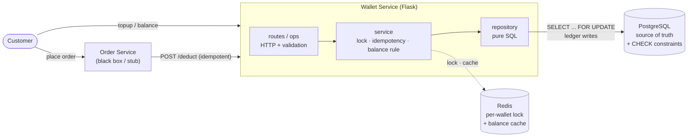
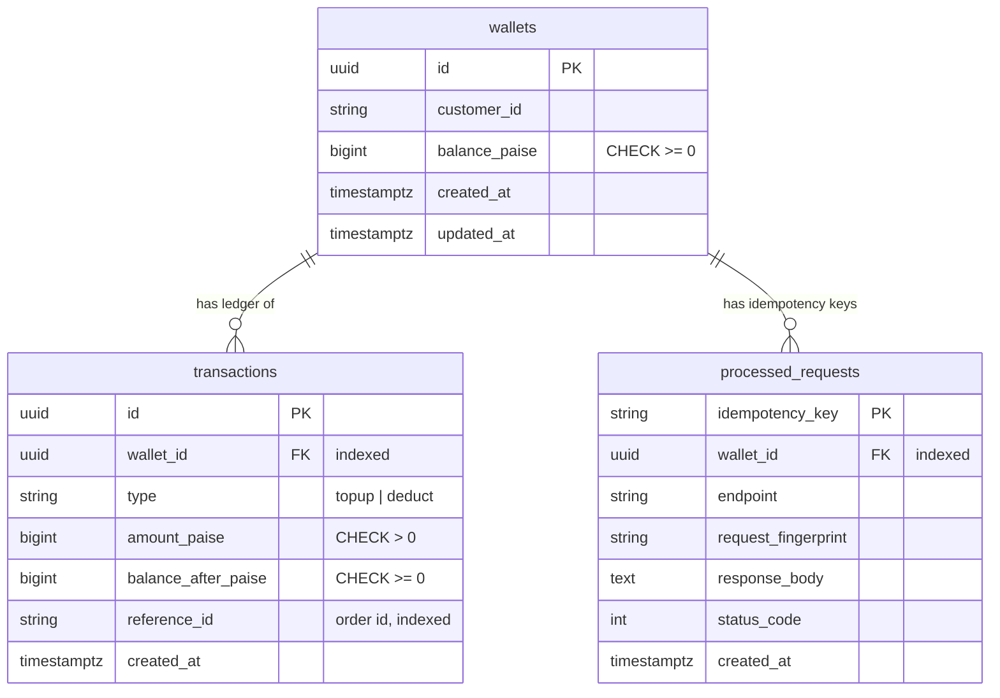
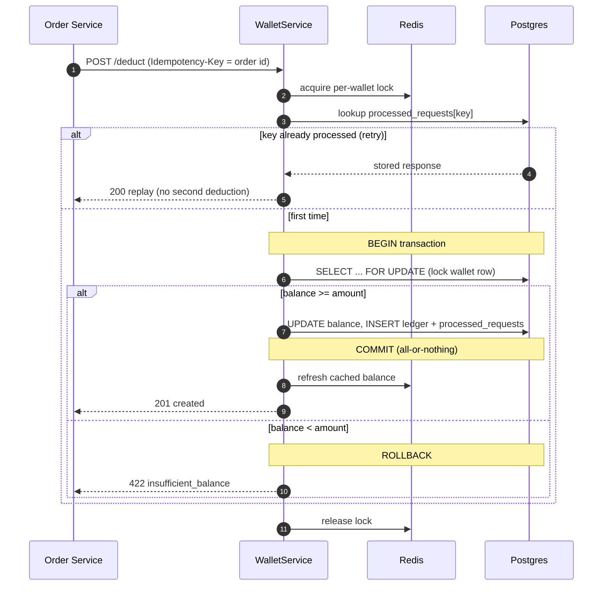

# Wallet Service

A logistics platform's Wallet Service. It owns customer balances, records every money
movement as an immutable ledger entry, and enforces one hard invariant:

> **A wallet can never go negative.** A deduction succeeds only if the balance covers it.

Built with **Python + Flask**, **PostgreSQL** (source of truth), and **Redis** (per-wallet
locking + balance caching).

---

## Architecture

The Order Service is a black box: it calls the Wallet Service over HTTP to deduct ₹100 when a
customer places an order. The Wallet Service owns all money state; Postgres is the source of
truth and Redis is a performance layer that is never trusted for correctness.



Requests flow through thin layers — **routes** (HTTP only) → **service** (business rules) →
**repository** (pure SQL). See [Key design decisions](#key-design-decisions) for why the
correctness guarantee lives in Postgres, not in the application.

---

## Quick start

```bash
# 1. Start Postgres + Redis, install deps, migrate, and run the service
./startup.sh
# service is now on http://localhost:5000  (Swagger UI at /docs)

# 2. In another terminal, run the Order Service integration demo
python order_service_stub.py

# 3. Run the tests (requires the docker services above to be up)
make test
```

`pgAdmin` connects to Postgres on `localhost:5432` (user/pass/db = `wallet`).
`Redis Insight` connects to Redis on `localhost:6379`.

Makefile shortcuts: `make up | down | migrate | run | test | stub`.

---

## API

All amounts are **integer paise** (100 paise = ₹1). Errors are always
`{"error": {"code": "...", "message": "..."}}`.

| Method | Path | Purpose | Success |
|--------|------|---------|---------|
| POST | `/wallets` | Create a wallet | 201 |
| POST | `/wallets/:id/topup` | Add funds | 201 (200 on idempotent replay) |
| POST | `/wallets/:id/deduct` | Deduct for an order (idempotent) | 201 (200 on replay) |
| GET | `/wallets/:id/balance` | Current balance | 200 |
| GET | `/wallets/:id/transactions` | Ledger history (newest first) | 200 |
| GET | `/health` | DB + Redis health, uptime | 200 / 503 |
| GET | `/metrics` | Prometheus metrics | 200 |
| GET | `/docs` | Swagger UI | 200 |

**Deductions require an idempotency key** — either the `Idempotency-Key` header or an
`idempotency_key` in the body. Use the `order_id`; retries then never double-charge.

```bash
curl -X POST localhost:5000/wallets/$ID/deduct \
  -H 'Idempotency-Key: order-123' \
  -H 'Content-Type: application/json' \
  -d '{"amount_paise": 10000, "reference_id": "order-123"}'
```

### Status codes
- `400` invalid request (bad/missing amount, missing idempotency key)
- `404` wallet not found
- `409` idempotency key reused with a *different* body
- `422` insufficient balance
- `503` wallet temporarily busy (lock contention) / dependency down

---

## Data model

`wallets` holds the authoritative balance. `transactions` is an append-only ledger — one
immutable row per money movement, carrying the running `balance_after`. `processed_requests`
records the outcome of each idempotent request so retries never double-charge.



**Invariants enforced by the database, not just code:**
- `CHECK (balance_paise >= 0)` — a negative balance is physically unstorable.
- `CHECK (amount_paise > 0)` — no zero/negative movements.
- `processed_requests.idempotency_key` is the primary key — a key is recorded at most once.
- Foreign keys + `NOT NULL` everywhere; indexes on `wallet_id` and `reference_id`.

---

## Request lifecycle: an idempotent deduction

This is the hard path — where concurrency, retries, and the balance rule all meet. The
Redis lock keeps writers off the same DB row; the row lock (`FOR UPDATE`) is the real
guarantee; the `processed_requests` row makes retries return the original response.



If the app crashes anywhere inside the transaction, Postgres rolls it back — no partial
write — and the Redis lock auto-expires. The `CHECK (balance_paise >= 0)` constraint is the
final backstop even if the application logic is wrong.

---

## Key design decisions

### 1. Immutable, double-entry-style ledger
The wallet row stores the balance for fast reads and locking, but **every movement is an
append-only `transactions` row** carrying `balance_after`. We never `UPDATE` a ledger row.
This gives auditability, reconciliation, and debuggability — the balance can always be
re-derived from the ledger, so the stored balance is verifiable rather than trusted blindly.

### 2. Pessimistic DB locking (`SELECT ... FOR UPDATE`) — not application locking
The correctness guarantee lives in the database:

```
BEGIN
  SELECT * FROM wallets WHERE id = ? FOR UPDATE   -- serialize writers on this row
  if balance < amount: ROLLBACK (422)
  UPDATE wallets SET balance = balance - amount
  INSERT INTO transactions (...)
  INSERT INTO processed_requests (...)
COMMIT
```

**Why DB locking over application locking?** An application lock (a mutex, or even a single
Redis lock alone) only holds within one process/instance and evaporates on crash or restart.
The moment you run two service instances, an app-only lock silently allows overselling. The
row lock is owned by the transaction: it survives across instances and is released atomically
on commit/rollback/crash. The `CHECK (balance >= 0)` constraint is the final backstop even if
application logic is wrong. This is pessimistic locking — appropriate here because deductions
on a hot wallet genuinely contend and we want them to *wait*, not fail-and-retry.

The Redis per-wallet lock is an **optimization layered on top**: it keeps concurrent requests
for the same wallet off the same DB row, reducing lock contention and connection hold time.
It is not relied upon for correctness.

### 3. Idempotency via a persisted `processed_requests` table
Real idempotency means a retry returns the *original response* and performs *no* second
effect. We persist each mutating request's key, a fingerprint of its parameters, and the
exact response. On replay:
- same key + same body → return the stored response (`200`), no second deduction;
- same key + different body → `409 idempotency_conflict` (a client bug we surface loudly).

The record is written inside the same transaction as the ledger entry, so idempotency and
the money movement commit atomically. A race between two identical requests is resolved by the
primary-key constraint (`IntegrityError` → re-read and replay).

### 4. Money as integer paise
Floating point and money don't mix. Everything is `BIGINT` paise; rupee strings are formatted
for display only, via integer division. No rounding surprises, ever.

### 5. Layering: controller → service → repository → DB
- `routes.py` / `ops.py` — HTTP only: validate, call service, shape JSON. No SQL.
- `service.py` — business rules, locking, idempotency, caching.
- `repository.py` — pure SQL/ORM queries.

Small interfaces make each layer independently testable and replaceable.

---

## Observability

- **Structured JSON logs** (`logging_config.py`) with a request id, method, path, status, and
  latency for every request, plus domain events (`wallet deduct` with old/new balance,
  transaction id, reference id). In production these lines become metrics and trace spans.
- **Prometheus `/metrics`**: request latency histogram, deduction/topup counters by outcome
  (`success | insufficient_balance | replay`) — e.g. deduction success rate and p99 latency.
- **`/health`**: verifies Postgres and Redis connectivity and reports uptime; returns `503`
  when a dependency is down (ready for a load balancer / k8s probe).

---

## Testing methodology

> Most bugs in payment systems come from concurrency and retries, not happy paths — so that
> is where the tests concentrate.

Tests are **integration tests against real Postgres + Redis** on purpose: row locking and
idempotency cannot be validated against a fake. Coverage includes:

- **Concurrency** — 20 orders race for a wallet that funds only 5; asserts exactly 5 succeed,
  final balance is 0, and it never goes negative.
- **Concurrent idempotent retries** — the same `order_id` fired 10× in parallel deducts once.
- **Idempotent replay** — duplicate request returns the same transaction, balance unchanged.
- **Idempotency conflict** — same key, different amount → `409`.
- **Insufficient balance** — `422`, balance untouched.
- **Multiple topups** accumulate correctly.
- **Ledger correctness** — every movement recorded with the right running `balance_after`.
- **Error handling** — unknown wallet `404`, invalid amount `400`, missing key `400`.

Run with `make test` (docker services must be up).

---

## Failure scenarios & how they're handled

| Scenario | Behaviour |
|----------|-----------|
| Order Service retries a deduct (network timeout) | Idempotency key → original response, no double charge |
| Two deducts race on the same wallet | Row lock serializes them; balance never oversold |
| App crashes mid-deduction | Transaction rolls back; no partial write; lock auto-released |
| Redis lock expires early | DB row lock + `CHECK` constraint still guarantee correctness |
| Redis is down | Balance reads fall back to Postgres; `/health` reports degraded |
| Bug tries to write a negative balance | `CHECK (balance >= 0)` rejects it at the DB |

---

## Production considerations (what I'd do with more time)

- **Read replicas** for `GET /balance` and history, with the balance cache in front.
- **Partition/shard** the `transactions` table by time or wallet as the ledger grows;
  add a background **reconciliation job** that re-derives balances from the ledger and alerts
  on drift.
- **Outbox pattern**: write a `wallet.deducted` event in the same transaction and publish it
  asynchronously, so the Order Service integration is exactly-once and decoupled.
- **Optimistic vs pessimistic locking**: pessimistic (`FOR UPDATE`) fits high-contention hot
  wallets here; a `version` column (optimistic) would suit low-contention, read-heavy paths.
- **Idempotency key TTL / archival** to keep `processed_requests` bounded.
- **AuthN/Z** at the API gateway (service tokens for the Order Service), **rate limiting** on
  generation endpoints, and **request size limits**.
- **Metrics → alerts**: deduction success rate, p99 latency, lock-timeout rate, error rate.
- **Distributed tracing** (propagate the request id as a trace id across services).

---

## Project layout

```
wallet_service/
  app.py            # Flask factory: wiring, middleware, error handlers
  routes.py         # HTTP controllers (wallet endpoints)
  ops.py            # /health, /metrics, /docs, /openapi.json
  service.py        # business logic: lock, idempotency, balance rule
  repository.py     # pure DB queries
  models.py         # SQLAlchemy models + constraints
  schemas.py        # pydantic request validation
  lock.py           # Redis per-wallet lock
  cache.py          # balance cache
  errors.py         # domain errors -> HTTP codes
  logging_config.py # structured JSON logging
  metrics.py        # Prometheus metrics
  openapi.py        # OpenAPI spec
migrations/         # Alembic migrations
tests/              # integration tests (concurrency-focused)
order_service_stub.py
docker-compose.yml  # postgres + redis (+ wallet under `full` profile)
Dockerfile  Makefile  startup.sh
```
